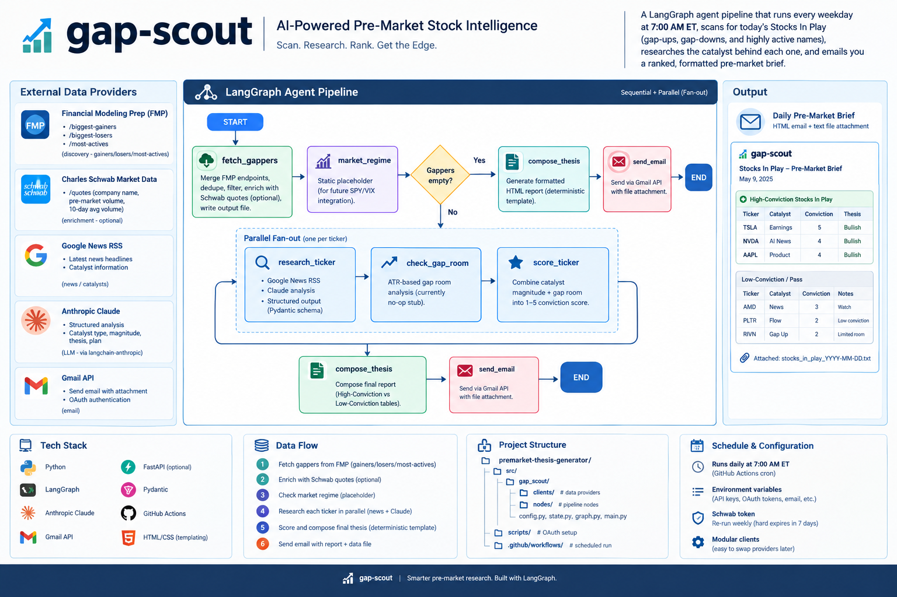

# gap-scout

A LangGraph agent pipeline that runs every weekday at **7:00 AM ET**, scans
for today's "Stocks In Play" (gap-ups, gap-downs, and highly active names),
researches the catalyst behind each one, and emails you a ranked, formatted
pre-market brief.

## Architecture




## How it works

```
START -> fetch_gappers -> market_regime -> [gappers empty?]
                                              |
                                yes ----------+---------- no
                                 |                          |
                                 v                          v
                          compose_thesis        (Send fan-out) research_ticker
                                 |                          |
                                 |                          v
                                 |                   check_gap_room
                                 |                          |
                                 |                          v
                                 |                    score_ticker
                                 |                          |
                                 +--------------+-----------+
                                                |
                                                v
                                         compose_thesis -> send_email -> END
```

| Node | What it does |
|---|---|
| `fetch_gappers` | Merges FMP's `/biggest-gainers`, `/biggest-losers`, and `/most-actives` into one deduped "Stocks In Play" table, tagged by category. Filters to price >= `MIN_PRICE`, allowed exchanges only, drops SPAC unit/warrant/rights tickers. Enriches the survivors with one batch Schwab `/quotes` call (company name, live pre-market volume, 10-day avg volume) -- resilient to missing/expired Schwab creds. Writes the full table to `output/stocks_in_play_{date}.txt`. |
| `market_regime` | Currently a static placeholder string (real SPY/VIX computation pending a Schwab price-history integration). Still runs as a genuine predecessor to `compose_thesis` in the sequential chain, ready for when it's real. |
| `research_ticker` | Runs **in parallel** (via LangGraph `Send`), once per ticker -- skipped entirely if there are zero gappers that day. Pulls headlines from Google News RSS and asks Claude for a structured read: catalyst type, a short human-readable category label, magnitude (small/medium/large), a 2-sentence summary, a trading thesis, and a bias + entry-trigger plan. All via a Pydantic schema (`with_structured_output`), not parsed free text. |
| `check_gap_room` | Currently a no-op stub (real ATR-based gap-room analysis was cut when FMP's historical-price endpoint was dropped; not yet rebuilt). |
| `score_ticker` | Combines catalyst magnitude + gap room into a 1-5 conviction score. |
| `compose_thesis` | **Deterministic HTML templating, no LLM call.** Tickers with conviction >= 4 get a full Catalyst/Thesis/Plan card under "High-Conviction Stocks In Play"; everything else lands in a "Low-Conviction / Pass" table instead of being dropped. Renders identically every run. |
| `send_email` | Sends via Gmail API (OAuth), with the day's `stocks_in_play_{date}.txt` attached as a real MIME attachment. |

State is a single shared `GraphState` `TypedDict` (see `src/gap_scout/state.py`).
`researched` uses an additive (`operator.add`) reducer since it's filled by
parallel fan-out; `assessed` is a plain field, fully recomputed by
`check_gap_room` and then `score_ticker`.

## Data providers used

- **Discovery (gainers/losers/most-actives):** [Financial Modeling Prep](https://site.financialmodelingprep.com/developer/docs) (`FMP_API_KEY`). Confirmed reliable at all hours, including pre-market -- Schwab's `/movers` was tried first but only reflects regular-session activity.
- **Enrichment (company name, pre-market volume, 10-day avg volume):** Charles Schwab Market Data API (`SCHWAB_APP_KEY`/`SCHWAB_APP_SECRET`/`SCHWAB_REDIRECT_URI`/`SCHWAB_TOKEN_JSON_B64`). Optional -- the pipeline degrades gracefully (zeros/blank) if these are missing or the refresh token has expired.
- **News / catalysts:** Google News RSS, no API key required (`src/gap_scout/clients/news_client.py`).
- **LLM (catalyst research):** Anthropic Claude via `langchain-anthropic` (`ANTHROPIC_API_KEY`).
- **Email:** Gmail API with OAuth (`GMAIL_TOKEN_JSON_B64`, `EMAIL_TO`).

### A note on Schwab's OAuth token

Schwab's refresh token **hard-expires every 7 days** with no way to extend
it -- unlike Gmail, there's no "production" tier that removes this for
individual developer apps. You'll need to re-run
`scripts/schwab_oauth_setup.py` roughly weekly and update
`SCHWAB_TOKEN_JSON_B64` in **both** your local `.env` and your GitHub Actions
secrets (they're two separate stores -- refreshing one does not update the
other). If you let it lapse, enrichment just silently degrades rather than
breaking the scheduled run.

### Swapping providers later

Each provider is isolated behind a small client class:
- `src/gap_scout/clients/fmp_client.py`
- `src/gap_scout/clients/schwab_client.py`
- `src/gap_scout/clients/news_client.py`
- `src/gap_scout/clients/gmail_client.py`

## Project layout

```
premarket-thesis-generator/
├── .env.example
├── .gitignore
├── README.md
├── CHANGELOG.md
├── VERSION
├── requirements.txt
├── src/
│   └── gap_scout/
│       ├── config.py          # env var loading
│       ├── state.py           # GraphState TypedDict
│       ├── graph.py           # StateGraph assembly (nodes + Send fan-out)
│       ├── main.py            # entrypoint, ET-time guard
│       ├── clients/
│       │   ├── fmp_client.py
│       │   ├── schwab_client.py
│       │   ├── news_client.py
│       │   └── gmail_client.py
│       └── nodes/
│           ├── fetch_gappers.py
│           ├── research_ticker.py
│           ├── check_gap_room.py
│           ├── score_ticker.py
│           ├── market_regime.py
│           ├── compose_thesis.py
│           └── send_email.py
├── scripts/
│   ├── gmail_oauth_setup.py   # one-time local OAuth token generator
│   └── schwab_oauth_setup.py  # OAuth setup -- re-run ~weekly, see note above
└── .github/
    └── workflows/
        └── gap-scout.yml      # scheduled trigger (cron)
```

## Setup

### 1. Install dependencies

```bash
python -m venv .venv && source .venv/bin/activate
pip install -r requirements.txt
```

### 2. Get API keys

- **FMP**: sign up at https://site.financialmodelingprep.com, grab your key.
- **Anthropic**: create a key at https://console.anthropic.com.
- **Schwab** (optional, for enrichment): create a Market Data app at https://developer.schwab.com.

### 3. Generate a Gmail OAuth token (one-time, local)

1. In [Google Cloud Console](https://console.cloud.google.com/), enable the
   **Gmail API** on a project and create an **OAuth Client ID** of type
   **Desktop app**.
2. Download the client secret JSON, save it as `scripts/client_secret.json`
   (already git-ignored -- never commit it).
3. Run:
   ```bash
   python scripts/gmail_oauth_setup.py
   ```
4. Sign in via the browser window that opens, grant the `gmail.send` scope.
5. Copy the printed base64 string.

### 4. Generate a Schwab OAuth token (optional, for enrichment -- repeat ~weekly)

```bash
python scripts/schwab_oauth_setup.py
```
Follow the prompts. Remember: this token expires in 7 days, on Schwab's side,
with no way around it.

### 5. Configure environment

```bash
cp .env.example .env
```

Fill in `FMP_API_KEY`, `ANTHROPIC_API_KEY`, `GMAIL_TOKEN_JSON_B64`,
`EMAIL_TO`, and (optionally) the four `SCHWAB_*` values.

### 6. Test it locally

The pipeline only runs near 7:00 AM ET by default. For a local test run at
any time of day, set `FORCE_RUN=true` in `.env`, then:

```bash
python -m src.gap_scout.main
```

### 7. Deploy the schedule (GitHub Actions)

Add these as **repository secrets** (Settings → Secrets and variables →
Actions): `FMP_API_KEY`, `ANTHROPIC_API_KEY`, `GMAIL_TOKEN_JSON_B64`,
`EMAIL_TO`, and the four `SCHWAB_*` values if using enrichment.

Push to `main` and the workflow picks up the schedule automatically (fires
at both possible UTC offsets to cover daylight saving; `main.py`'s time
guard ensures only one actually sends an email). Trigger manually anytime
from the **Actions** tab (`workflow_dispatch`, `force: true` by default).

Why GitHub Actions cron instead of Lambda or a long-running process: this is
a once-a-day, short-lived batch task with no need to be always-on -- free on
public repos, no infrastructure to manage, secrets handled natively.

## Notes / things you may want to tune

- `NUM_GAPPERS_PER_DIRECTION`, `MIN_PRICE` (default 3), `MIN_VOLUME`,
  `ALLOWED_EXCHANGES` -- discovery quality filters, in `.env`.
- `HIGH_CONVICTION_THRESHOLD` (default 4, in `compose_thesis.py`) -- the
  conviction cutoff between a full card and a Pass-table row.
- `check_gap_room` and `market_regime` are both still stubs -- rebuilding
  real ATR/regime computation (likely on Schwab price-history) is the
  next major piece of unfinished work.
- The Anthropic model defaults to `claude-sonnet-4-6`; override via
  `ANTHROPIC_MODEL` in `.env`.